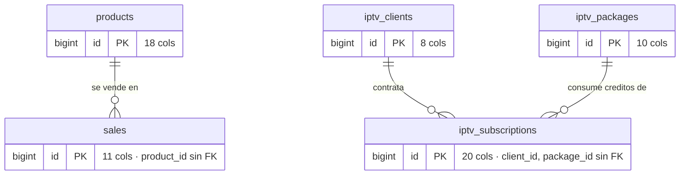
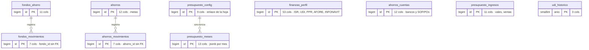
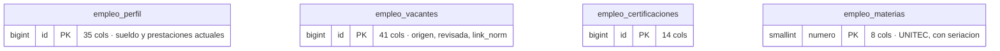
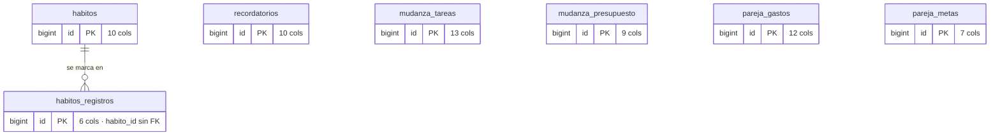

# Esquema de la base — VentasPro

31 tablas en `public`, agrupadas por lo que hacen. Levantado del esquema real
en producción, no de las migraciones.

## El hallazgo que importa

**No hay ni una sola llave foránea.** Las 31 tablas están sueltas. `ahorros_movimientos.ahorro_id` apunta a `ahorros.id` de palabra, no de hecho: si
borras una meta, sus movimientos se quedan huérfanos y nadie se entera.

Eso no es un descuido menor, pero tampoco es urgente en un tablero de una sola
persona. Es deuda que cobra intereses el día que dos cosas tengan que cuadrar.

---

## Negocio

## Dinero

`finanzas_perfil` con 53 columnas es una tabla-cajón: mete supuestos fiscales,
el PPR, la AFORE y el INFONAVIT en una sola fila. Funciona porque solo hay un
usuario, pero es lo primero que se rompería con dos.

## Carrera

## Vida

## Infraestructura

`exchange_rates`, `pdf_reportes` (la única con `user_id` de Clerk).

---

## Tablas muertas

Existen y nadie las consulta. Se dejan porque borrar datos no se hace sin
preguntar, pero no son parte del sistema:

- **`presupuesto`** — quedó de antes de que Presupuesto leyera la hoja de Google.
- **`sheets_config`** — resto del Sheets Sync que nunca se terminó.

## Tablas fantasma

El código las pide y no existen. Es lo que rompe **Sheets Sync**:

- `sheets_sync_config` — la base tiene `sheets_config`, con otro nombre.
- `sheets_cache`
- `sheets_write_queue`

Las edge functions `sync-sheets` y `write-to-sheet` están en el repo pero **no
desplegadas** (responden 404). Nunca corrió esa cadena completa.

---

## Sobre `user_id` y Clerk

Solo `pdf_reportes` guarda el `user_id` de Clerk. Las otras 30 tablas asumen un
único usuario.

No es un error mientras el tablero sea de una persona. Se vuelve uno el día que
entre alguien más — y ese mismo día importa más el **RLS**, que hoy está apagado
en todas las tablas con la llave anónima viajando en el paquete público.

Orden correcto si alguna vez se comparte: primero `user_id` en todas, luego RLS,
y solo entonces invitar a alguien.
